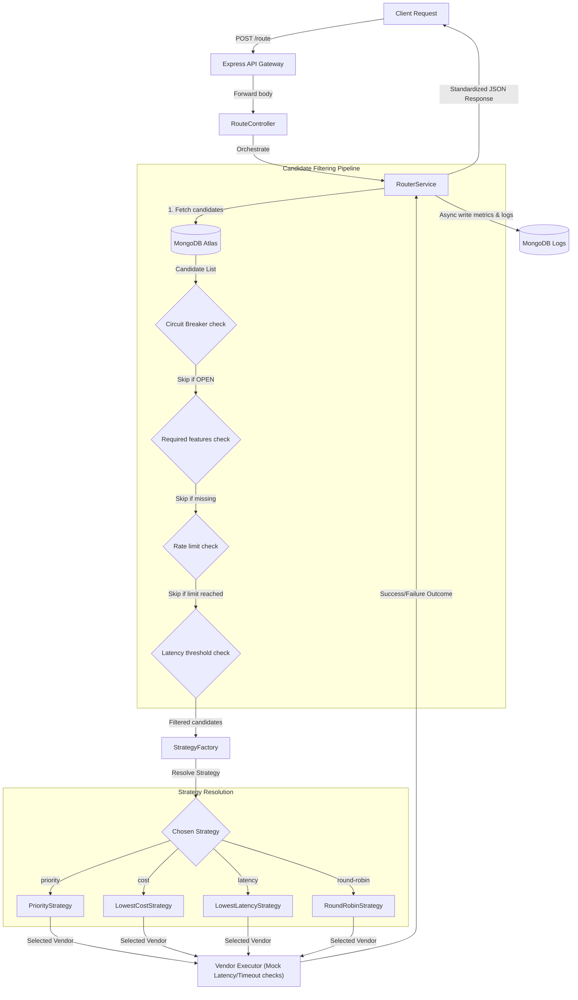
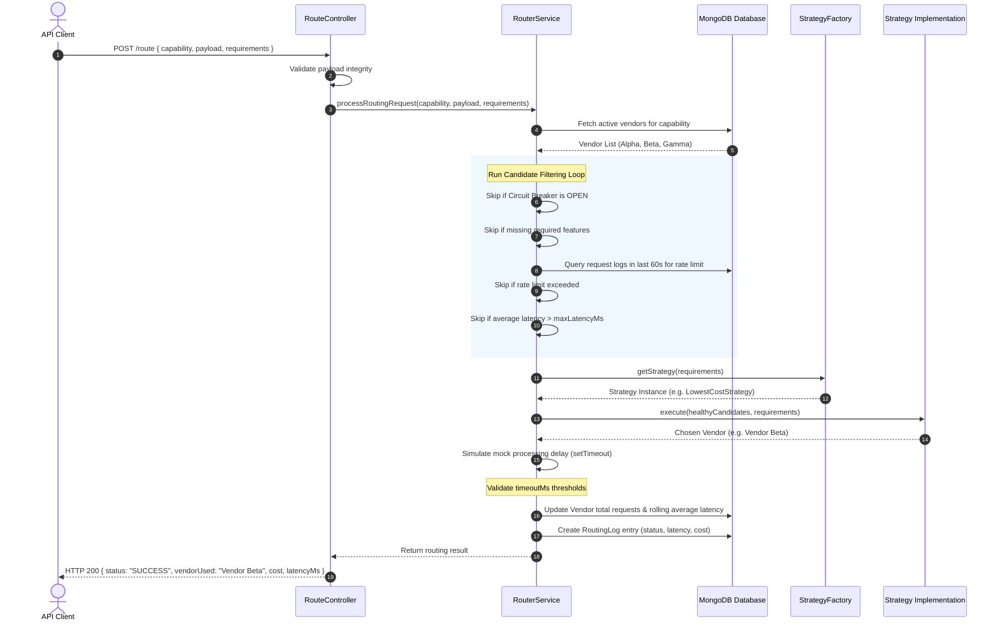

# Intelligent Vendor Routing Platform

An intelligent, enterprise-grade routing platform that acts as a unified API gateway between client applications and multiple third-party API providers (such as PAN verification, OCR, or payment processors). The platform dynamically routes incoming requests to the best available vendor based on real-time performance metrics, capability requirements, cost constraints, and vendor availability using the Strategy Pattern, Circuit Breakers, and Agentic AI.

---

## Architecture Overview

In a production environment, this platform operates as a high-throughput API gateway layer. It manages connection lifecycles, circuit-breaking, rate-limiting, and telemetry updates asynchronously, isolating the client from vendor-side performance anomalies.

### Core Architectural Layers

1. **API Gateway Layer (Express App)**: Serves as the entry point. Parses incoming payloads, maps endpoints, and forwards requests to the controller.
2. **Global Error Handling Middleware**: Captures exceptions thrown anywhere in the execution stack and maps them to clean, standardized JSON structures and appropriate HTTP status codes.
3. **Controller Layer (Express Controllers)**: Isolates the HTTP request-response cycle. Uses an `asyncHandler` wrapper to eliminate repetitive try-catch blocks.
4. **Core Orchestration Layer (RouterService)**: Feeds candidates from the database and runs them through a sequential pipeline of health filters (Circuit Breaker, Feature Compatibility, Rate Limit, Latency Limits).
5. **Strategy Pattern Execution Layer (StrategyFactory & Strategies)**: Resolves the optimal vendor from the list of healthy candidates at runtime using interchangeable sorting strategies (Priority, Cost, Latency, Round-Robin).
6. **Telemetry & Audit Logging Layer (MongoDB & RoutingLog)**: Tracks execution latencies, status codes, costs, and decisions.

---

## System Flow Diagrams

### Request Lifecycle Flowchart



### Execution Sequence Diagram



---

## Explanation of Routing Decisions

The platform uses a two-phase pipeline to decide which vendor receives traffic: **Phase 1: Candidate Filtering** and **Phase 2: Strategy Resolution**.

### 1. Candidate Filtering Pipeline
When a request arrives, the engine queries all active vendors supporting the requested `capability` and runs them through a sequence of filters. A vendor is skipped if it fails any check:
- **Circuit Breaker Check**: If the vendor's circuit breaker status is `OPEN`, it is skipped. The status transitions to `OPEN` when a simulated execution times out or fails. A `30-second cooldown` applies, after which the vendor enters a `HALF-OPEN` testing state.
- **Feature Compatibility Check**: If the client specifies `requiredFeatures` in `requirements`, the vendor is skipped unless its `supportedFeatures` array contains all of them.
- **Rate Limit Check**: Checks the total requests processed by this vendor in the last 60 seconds (queried from the `RoutingLog` collection). If this count is greater than or equal to the vendor's `rateLimitPerMinute`, it is skipped to avoid rate-limit errors.
- **Latency Threshold Check**: Computes the rolling average of the vendor's last 20 execution latencies. If this average exceeds the client's `maxLatencyMs` requirement, the vendor is skipped.

*Fallback Rule*: If the pipeline filters out all vendors, **Outage Fallback Mode** activates. The engine bypasses all filters and uses the full candidate list to avoid complete service outage.

### 2. Strategy Resolution Pattern
Once healthy candidates are filtered, the system dynamically delegates the final selection to one of the interchangeable routing strategies:
- **Priority Strategy (Default)**: Selects the vendor with the highest priority rank (lowest numeric `priority` value, e.g. 1 is highest priority).
- **Lowest Cost Strategy**: Sorts the candidates by `costPerRequest` and selects the cheapest.
- **Lowest Latency Strategy**: Sorts candidates by their rolling average latency and selects the fastest.
- **Round-Robin Strategy**: Cycles sequentially through the candidates on every request to distribute load evenly, maintaining index offsets in-memory using a Singleton instance map.

---

## Design Principles: SOLID and KISS

### SOLID Implementation

- **Single Responsibility Principle (SRP)**:
  - Models (`Vendor.js`, `RoutingLog.js`) only define Mongoose database schemas.
  - Strategy classes (e.g. `PriorityStrategy.js`) contain only the sorting logic for vendor candidates.
  - Centralized middleware ([errorHandler.js](file:///d:/PROJECTS/signzy%20vendor%20routing%20platform/middlewares/errorHandler.js)) isolates exception formatting from routing flows.
  - `RouterService.js` coordinates filtering, timing, and log writes.
  - Controllers contain only HTTP bindings.
- **Open/Closed Principle (OCP)**:
  - The routing service is closed to modification but open to extension. Adding new strategies (e.g., Health-based routing) is done by creating a new class under `strategies/` and registering it in `StrategyFactory.js`. The main orchestrator (`RouterService.js`) remains untouched.
- **Liskov Substitution Principle (LSP)**:
  - All strategy implementations implement a standard interface: `execute(candidates, requirements)`. They are completely interchangeable and substitutable.
- **Interface Segregation Principle (ISP)**:
  - Strategies receive only the parameters required for candidate selection (the filtered candidates list and requirements), keeping them decoupled from database connection details.
- **Dependency Inversion Principle (DIP)**:
  - The `RouterService` does not depend on concrete vendor selection logic; instead, it depends on the strategy abstraction resolved at runtime via the `StrategyFactory`.

### KISS Implementation (Keep It Simple, Stupid)

- **Centralized Error-Handling Middleware**: Rather than writing repetitive try-catch blocks in every controller method, exceptions are caught globally. An `asyncHandler` wrapper forwards async errors to the global Express error handler, making the codebase DRY and clean.
- **Stateful Round-Robin**: Instead of maintaining a complex database tracking system or distributed lock structure to count sequential requests, the round-robin counter is managed in-memory using JavaScript `Map` lookups inside a **Singleton** strategy instance.
- **Dynamic Average Latency**: To prevent calculating average latencies via heavy, database-wide queries on logs, we store a circular rolling array buffer of the last 20 latencies on the vendor document itself, keeping metric reads instantaneous.
- **Resilient AI Pipeline**: The Agentic AI config parser implements a robust hybrid model. It attempts to call the LLM (`gemini-2.0-flash`), but automatically falls back to a regex-based parser if the API key is not configured or network requests fail, avoiding potential crash states.

---

## API Request and Response Examples

### Register a Vendor
- **Endpoint**: `POST /vendors`
- **Request Body**:
```json
{
  "name": "Vendor Alpha",
  "capabilities": ["PAN_VERIFICATION", "AADHAAR_VERIFICATION"],
  "costPerRequest": 1.5,
  "timeoutMs": 1500,
  "rateLimitPerMinute": 200,
  "priority": 1,
  "supportedFeatures": ["OCR", "LIVE_FACEMATCH", "FUZZY_MATCHING"]
}
```
- **Response**:
```json
{
  "status": "SUCCESS",
  "message": "Vendor successfully provisioned into routing core architecture.",
  "vendorId": "6a48aed15752fc86c4ee44bc"
}
```

### Route Traffic (Priority Strategy)
- **Endpoint**: `POST /route`
- **Request Body**:
```json
{
  "capability": "PAN_VERIFICATION",
  "payload": {
    "pan": "ABCDE1234F",
    "name": "Rahul Sharma"
  }
}
```
- **Response**:
```json
{
  "status": "SUCCESS",
  "vendorUsed": "Vendor Alpha",
  "routingReason": "Vendor Alpha selected using standard PriorityStrategy selection logic.",
  "latencyMs": 457,
  "cost": 1.5,
  "response": { "panStatus": "VALID", "nameMatch": true }
}
```

### Route Traffic (Lowest Cost Strategy)
- **Endpoint**: `POST /route`
- **Request Body**:
```json
{
  "capability": "PAN_VERIFICATION",
  "payload": { "pan": "ABCDE1234F" },
  "requirements": {
    "preferLowCost": true
  }
}
```
- **Response**:
```json
{
  "status": "SUCCESS",
  "vendorUsed": "Vendor Beta",
  "routingReason": "Vendor Beta selected using standard LowestCostStrategy selection logic.",
  "latencyMs": 856,
  "cost": 0.9,
  "response": { "panStatus": "VALID", "nameMatch": true }
}
```

### Fetch Live Vendor Metrics
- **Endpoint**: `GET /vendor-metrics`
- **Response**:
```json
{
  "status": "SUCCESS",
  "metrics": {
    "Vendor Alpha": {
      "totalRequests": 3,
      "rollingAvgLatencyMs": 459,
      "circuitBreakerState": "CLOSED"
    },
    "Vendor Beta": {
      "totalRequests": 5,
      "rollingAvgLatencyMs": 860,
      "circuitBreakerState": "CLOSED"
    }
  }
}
```

### Get AI Insights
- **Endpoint**: `GET /agent/insights`
- **Response**:
```json
{
  "status": "SUCCESS",
  "insights": {
    "unhealthyVendors": [
      {
        "name": "Vendor Timeout Test",
        "healthStatus": "UNHEALTHY_CIRCUIT_BROKEN",
        "reason": "Circuit breaker is OPEN. Last failure occurred at Sat Jul 04 2026 19:00:39 GMT+0530."
      }
    ],
    "strategyRecommendations": [
      "Recommendation: Enable Failover/Fallback Routing logic to bypass active outages."
    ],
    "suggestedFallbackRules": [
      "Since Vendor Timeout Test is UNHEALTHY CIRCUIT BROKEN, automatically route its traffic to healthy alternatives: Vendor Alpha, Vendor Beta, Vendor Gamma."
    ]
  }
}
```

### Translate English to Configuration JSON
- **Endpoint**: `POST /agent/generate-config`
- **Request Body**:
```json
{
  "prompt": "Split traffic 70% to Vendor Alpha and 30% to Vendor Beta. Route to Vendor Gamma if latency is over 500 ms"
}
```
- **Response**:
```json
{
  "status": "SUCCESS",
  "parserType": "DETERMINISTIC_REGEXP_FALLBACK",
  "prompt": "Split traffic 70% to Vendor Alpha and 30% to Vendor Beta. Route to Vendor Gamma if latency is over 500 ms",
  "configuration": {
    "strategy": "weighted",
    "vendors": [
      { "name": "Vendor Alpha" },
      { "name": "Vendor Beta" },
      { "name": "Vendor Gamma" }
    ],
    "fallbackRules": {
      "switchTarget": "Vendor Gamma",
      "latencyThresholdMs": 500,
      "errorRateThresholdPct": null
    }
  }
}
```

---

## Getting Started

### 1. Install Dependencies
```bash
npm install
```

### 2. Configure Environment
Create a `.env` file in the root directory:
```env
MONGO_URI=your-mongodb-connection-string
PORT=3000
GEMINI_API_KEY=your-gemini-api-key # Optional: For probabilistic LLM prompt parsing
```

### 3. Run the Server
```bash
npm run dev
```
The gateway server will be live at `http://localhost:3000`.
